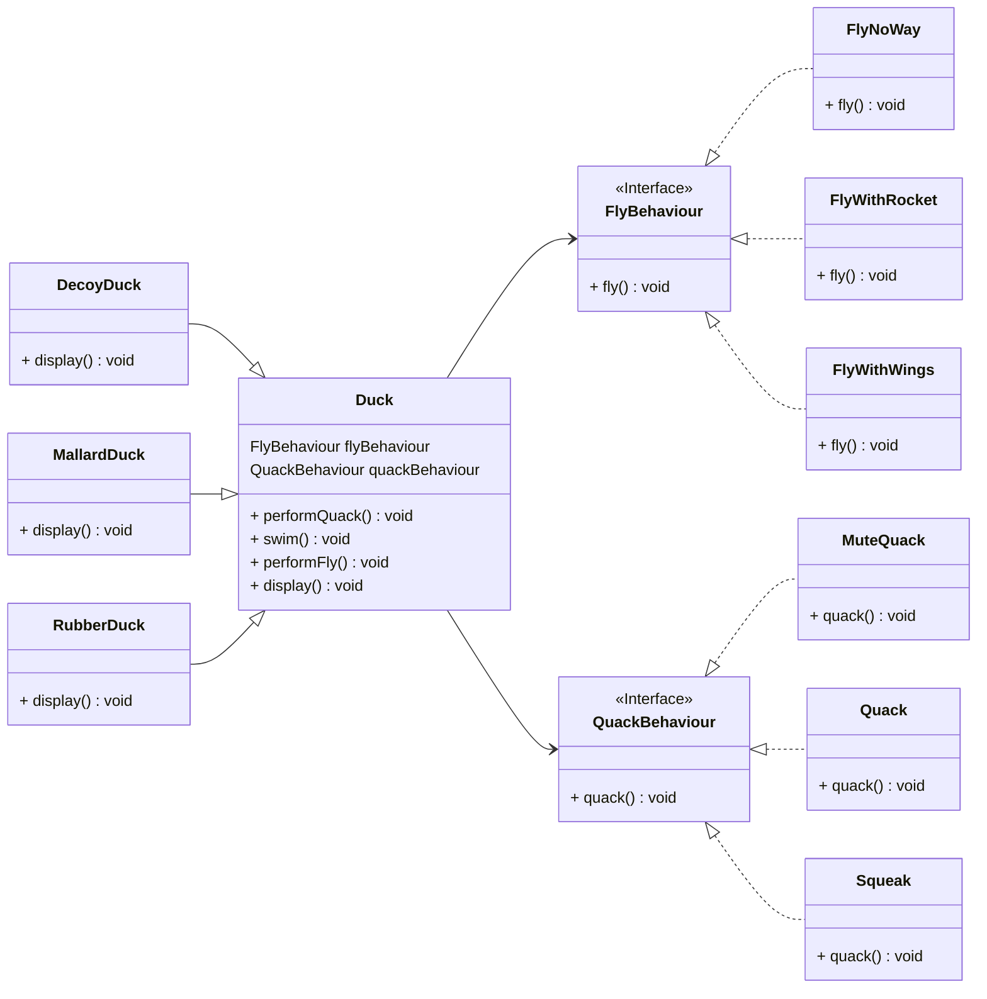

# Strategy

### Intent
**Strategy** is a behavioral design pattern that defines a family of algorithms, encapsulates each one, and makes them interchangeable.  
Strategy lets the algorithm vary independently of clients that use it.

### Structure

A Strategy pattern consists of the following parts:

* **Context**: The context maintains a reference to one of the concrete strategies and communicates with this object only via the strategy interface. Usually, a context means a class that has a field for storing a reference to one of the strategies.

* **Strategy**: The strategy is an interface (super-type) common to all supported algorithms. It declares a method the context uses to execute a strategy. In practice, the strategy interface usually provides just a single method for executing the algorithm in each concrete strategy class.

* **Concrete Strategies**: These are one or more implementations of the strategy interface. Each concrete strategy implements an algorithm using the strategy interface.

* **Execution**: The context calls the execution method on the linked strategy object each time it needs to run the algorithm. The context doesn’t know what type of strategy it works with or how the algorithm is executed.

* **Client**: The client creates a specific strategy object and passes it to the context. The context exposes a setter which lets clients replace the strategy associated with the context at runtime. In practice, the client is usually a class that contains some business logic that uses the context object and the strategy object to solve a particular problem.

### Applicability
* Use the Strategy pattern when you want to use different variants of an algorithm within an object and be able to switch from one algorithm to another during runtime.

* Use the Strategy when you have a lot of similar classes that only differ in the way they execute some behavior.

* Use the pattern to isolate the business logic of a class from the implementation details of algorithms that may not be as important in the context of that logic.

* Use the pattern when your class has a massive conditional statement that switches between different variants of the same algorithm.

### Class Diagram of Strategy Pattern

