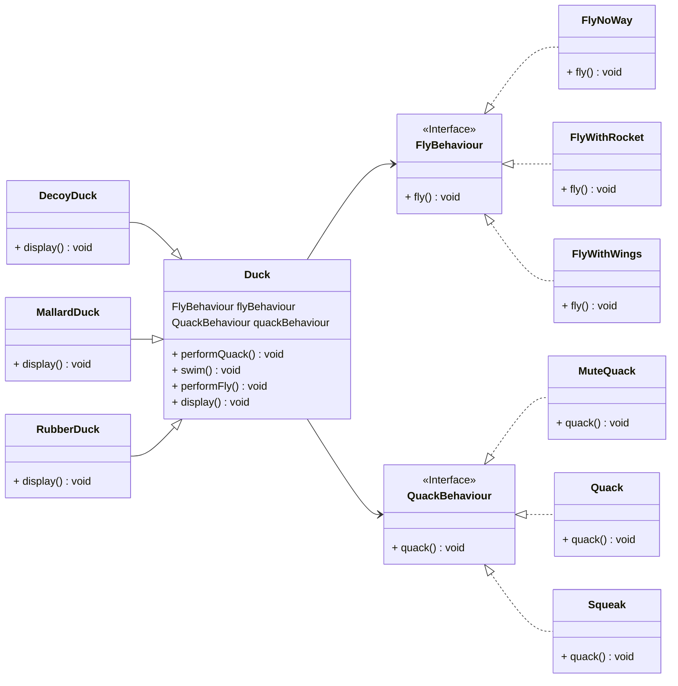

```mermaid
classDiagram
    direction BT
    class Duck {
        + performQuack() void
        + swim() void
        + performFly() void
        + display() void
        FlyBehaviour flyBehaviour
        QuackBehaviour quackBehaviour
    }

    class FlyBehaviour {
        <<Interface>>
        + fly() void
    }

    class QuackBehaviour {
        <<Interface>>
        + quack() void
    }

    Duck --> FlyBehaviour
    Duck --> QuackBehaviour

    direction LR
    class DecoyDuck {
        + display() void
    }
    class MallardDuck {
        + display() void
    }
    class RubberDuck {
        + display() void
    }
    
    DecoyDuck --|> Duck
    MallardDuck --|> Duck
    RubberDuck --|> Duck


    direction LR
    class FlyNoWay {
        + fly() void
    }
    class FlyWithRocket {
        + fly() void
    }
    class FlyWithWings {
        + fly() void
    }

    FlyBehaviour <|.. FlyNoWay
    FlyBehaviour <|.. FlyWithRocket
    FlyBehaviour <|.. FlyWithWings
    direction LR
    class MuteQuack {
        + quack() void
    }
    class Quack {
        + quack() void
    }
    class Squeak {
        + quack() void
    }

    QuackBehaviour <|.. MuteQuack
    QuackBehaviour <|.. Quack
    QuackBehaviour <|.. Squeak

```
